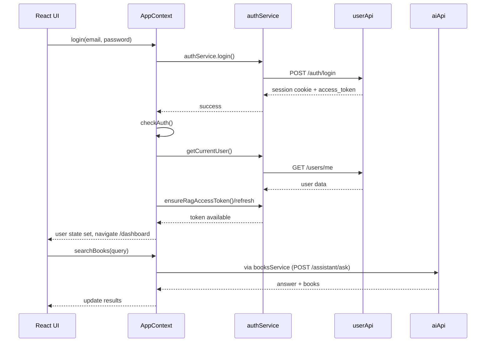

# AppContext Flow (Frontend -> Backend)

This document explains how `Frontend/src/context/AppContext.jsx` works, what `config`, `services`, and `utils` do, and how everything connects to backend services.

## High-Level Flowchart

```mermaid
flowchart TD
    A[React Components<br/>useApp()] --> B[AppContext Provider<br/>AppContext.jsx]

    B --> C[authService]
    B --> D[booksService]
    B --> E[tokenManager]
    B --> F[config.CACHE_DURATION]

    C --> G[userApi axios instance]
    D --> G
    D --> H[aiApi axios instance]

    G --> I[USER_API_URL<br/>from services/config.js]
    H --> J[AI_API_URL<br/>from services/config.js]

    G --> K[user-service / identity-service]
    H --> L[lit-ai-engine]

    H --> M[Bearer token from memory]
    G --> N[withCredentials cookies]
    H --> N

    G --> O[401? refresh token<br/>POST /auth/refresh]
    H --> O
    O --> P[setMemoryAccessToken]
    P --> H

    B --> Q[Dashboard cache refs]
    Q --> R[forYou/popular/genre/similar]
```

## Folder Responsibilities

### 1) `context` (`AppContext.jsx`)
- Holds global app state: `user`, `loading`, `searchResults`, recommendations, profile stats.
- Exposes actions: `login`, `register`, `logout`, `searchBooks`, `fetchForYouBooks`, `loadProfile`, etc.
- Central orchestrator: components call context methods, context calls service layer.

### 2) `services`
- API communication layer.
- `auth.js`: login/register/logout/current-user/refresh/google auth flow.
- `books.js`: AI search, recommendations, books data, user profile/books/activity, quiz APIs.
- `api.js`: axios setup, request/response interceptors, 401 refresh retry logic.
- `config.js`: service URLs + app constants (including cache duration).

### 3) `utils`
- Support helpers that are not UI or network clients.
- `tokens.js`: in-memory token handling + cookie/local cleanup helpers.
- Used during auth failures/logout (`tokenManager.clear()`), and by services for token behavior.

## Request Lifecycle (Step-by-step)

1. A component calls a function from `useApp()` (example: `searchBooks("atomic habits")`).
2. `AppContext` forwards request to `booksService.searchBooks(...)`.
3. `booksService` calls `aiApi.post("/assistant/ask", ...)`.
4. `aiApi` base URL comes from `AI_API_URL`.
5. Axios interceptor attaches Bearer access token (if available).
6. If API returns `401`, interceptor attempts `POST /auth/refresh` on `USER_API_URL`.
7. New token is stored in memory and original request is retried.
8. Service returns normalized response to `AppContext`.
9. `AppContext` updates state; UI re-renders.

## Auth Flow (Session + Token)



## Caching in `AppContext`

- `dashboardCacheRef` stores recommendations in memory:
  - `forYou`, `popular`, `genre`, `similar.pages`.
- `sectionsCacheRef` stores grouped sections payload.
- Cache validity uses `CACHE_DURATION` from `services/config.js`.
- `forceRefresh = true` bypasses cache.

## Backend Mapping Summary

- `userApi` (`USER_API_URL`, default `http://localhost:8000`) ->
  - auth, user profile, user books, activity, quiz history/score.
- `aiApi` (`AI_API_URL`, default `http://localhost:8001`) ->
  - assistant search, book details/summary, recommendations, tracking.

## Note to Verify

In `AppContext.jsx`, `checkAuth()` calls `authService.ensureRagAccessToken()`, while `auth.js` exposes `ensureAiAccessToken()`.  
If no alias exists elsewhere, this should be renamed to avoid runtime errors.
